# Assistant Context

## Live Context

## Screenshot [00:16:11]
Window: Richard - nacarmos - Slack

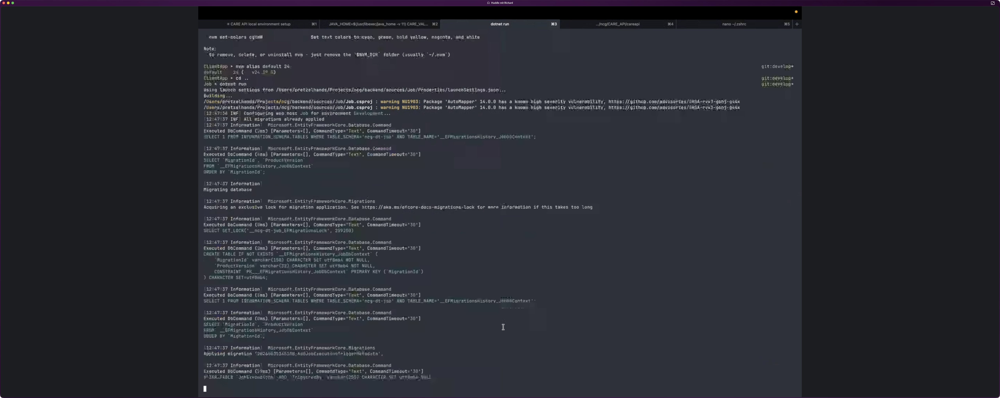

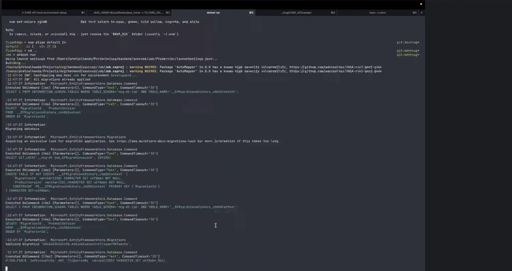

### OCR

No people or participant tiles are visible. The meeting title says “Huddle mit Richard,” so Richard is strongly deducible as an attendee, but the full participant list is not clear from this screenshot.

The shared/presented content appears to be a developer terminal session, likely the presenter’s shared screen. The active tab is running `dotnet run` for a CARE/API backend project. The visible activity shows a .NET service starting, package vulnerability warnings, and Entity Framework Core database migration SQL/log output.

Visible terminal content, cleaned up:

```markdown
## Terminal / tmux tabs

- `* CARE API local environment setup` #1
- `JAVA_HOME=$(/usr/libexec/java_home -v 11) CARE_VAL...` #2
- `dotnet run` #3
- `~/ncg/CARE_API/careapi` #4
- `nano ~/.zshrc` #5

## Commands and output

```bash
nvm set-colors cyan
# Set text colors to cyan, green, bold yellow, magenta, and white

# Note:
# to remove, delete, or uninstall nvm - just remove the `$NVM_DIR` folder (usually `~/.nvm`)

ClientApp > nvm alias default 24
default -> 24 (... v24.??.0)

ClientApp > cd ..

Job > dotnet run
Using launch settings from /Users/poetzelhands/Projects/ncg/backend/sources/Job/Properties/launchSettings.json...
Building...

/Users/poetzelhands/Projects/pcg/backend/sources/Job/Job.csproj : warning NU1903:
Package 'AutoMapper' 14.0.0 has a known high severity vulnerability

[12:47:37 INF] Configuring web host Job for environment qaTestOnline...
[12:47:37 INF] Application started on appUrl

[12:47:37 Information] Microsoft.EntityFrameworkCore.Database.Command
Executed DbCommand (...) [Parameters=[], CommandType='Text', CommandTimeout='30']

SELECT 1 FROM INFORMATION_SCHEMA.TABLES
WHERE TABLE_SCHEMA='ncg-dt-job'
AND TABLE_NAME='__EFMigrationsHistory_JobDbContext';

SELECT `MigrationId`, `ProductVersion`
FROM `__EFMigrationsHistory_JobDbContext`
ORDER BY `MigrationId`;

[12:47:37 Information] Microsoft.EntityFrameworkCore.Migrations
Migrating database

Acquiring an exclusive lock for migration application.
See https://aka.ms/efcore-docs-migrations-lock for more information if this takes too long

SELECT GET_LOCK('__ncg-dt-job_EFMigrationsLock', 259200)

CREATE TABLE IF NOT EXISTS `__EFMigrationsHistory_JobDbContext` (
  `MigrationId` varchar(150) CHARACTER SET utf8mb4 NOT NULL,
  `ProductVersion` varchar(32) CHARACTER SET utf8mb4 NOT NULL,
  CONSTRAINT `PK___EFMigrationsHistory_JobDbContext` PRIMARY KEY (`MigrationId`)
) CHARACTER SET=utf8mb4;

Applying migration ...
```
```

## Screenshot [00:16:42]
Window: Richard - nacarmos - Slack

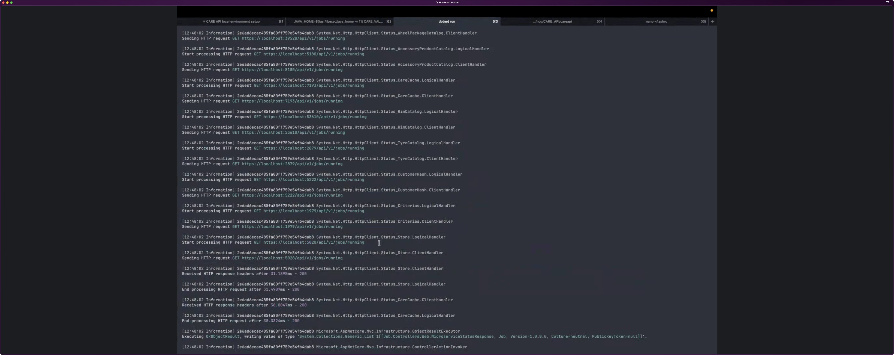

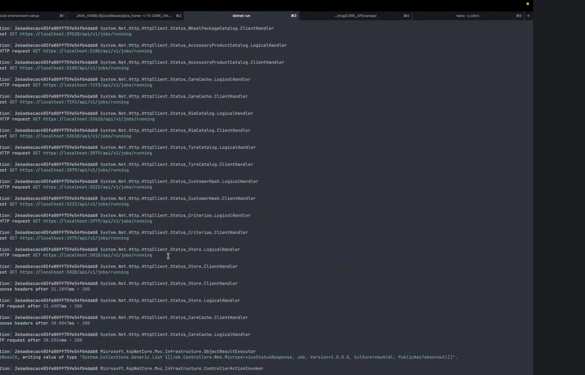

### OCR

No participant tiles or webcams are visible. It is not clear exactly who is in the meeting; the title bar says “Huddle mit Richard,” so Richard is strongly deduced as an attendee, but the visible attendee list is partial/nonexistent.

Who appears to be talking: not visible/unclear.  
Who appears to be presenting: not visible/unclear; a shared terminal or development environment is being shown.  
What is being presented: a terminal session running a CARE API local environment, showing .NET `HttpClient`/ASP.NET Core logs and repeated `/api/v1/jobs/running` requests to localhost services.

Visible shared-screen content:
- Window/tab context:
  - `* CARE API local environment setup`
  - `JAVA_HOME=$(/usr/libexec/java_home -v 11) CARE_VAL...`
  - `dotnet run`
  - `~/ncg/CARE_API/careapi`
  - `nano ~/.zshrc`
- Terminal/log content includes:
  - `[12:48:02 Information] ... System.Net.Http.HttpClient.Status_WheelPackageCatalog.ClientHandler`
  - `Sending HTTP request GET https://localhost:39528/api/v1/jobs/running`
  - `Status_AccessoryProductCatalog` requests to `https://localhost:5180/api/v1/jobs/running`
  - `Status_CareCache` requests to `https://localhost:7193/api/v1/jobs/running`
  - `Status_RimCatalog` requests to `https://localhost:53610/api/v1/jobs/running`
  - `Status_TyreCatalog` requests to `https://localhost:2879/api/v1/jobs/running`
  - `Status_CustomerHash` requests to `https://localhost:5222/api/v1/jobs/running`
  - `Status_Criterias` requests to `https://localhost:1979/api/v1/jobs/running`
  - `Status_Store` requests to `https://localhost:5028/api/v1/jobs/running`
  - Responses show HTTP `200`, including timings such as `31.1895ms`, `31.4907ms`, `38.0047ms`, and `38.3324ms`
  - ASP.NET Core line: `Executing OkObjectResult, writing value of type 'System.Collections.Generic.List`1[[Job.Controllers.Web.MicroservicesStatusResponse, Job, Version=1.0.0.0, Culture=neutral, PublicKeyToken=null]]'`

## Screenshot [00:17:06]
Window: Richard - nacarmos - Slack

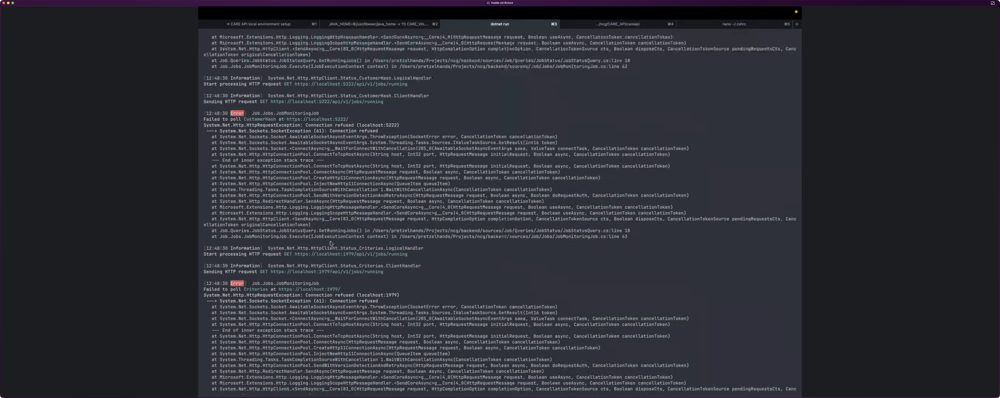

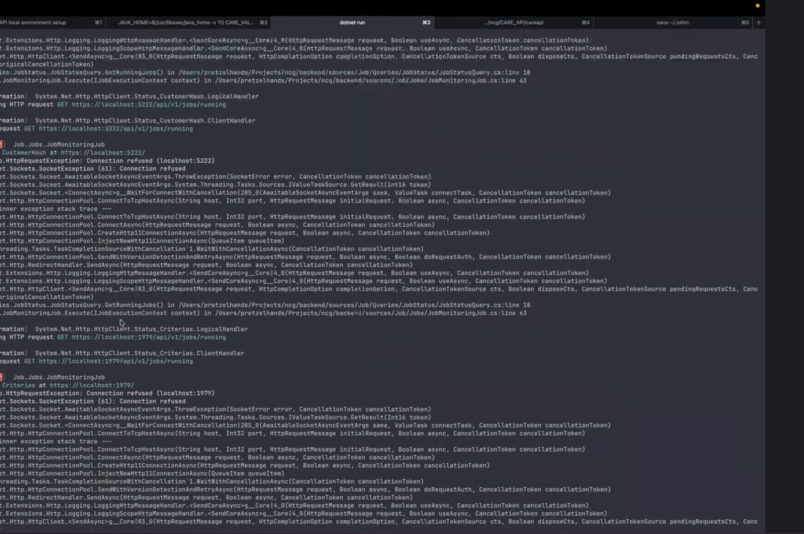

### OCR

**Meeting Notes Extract**

- No person or participant tile is visible, so it is not clear who is talking.
- A shared screen appears to be visible, showing a terminal session with .NET/backend logs.
- The meeting title bar says `Huddle mit Richard`, so `Richard` is strongly deduced as an attendee, but the visible participant list is not complete.
- It is not clear exactly who is presenting; the screen share does not show a presenter name.

**Shared Screen Content**

Visible terminal tabs include:

- `CARE API local environment setup`
- `JAVA_HOME=$(/usr/libexec/java_home -v 11) CARE_VAL...`
- `dotnet run`
- `~/ncg/CARE_API/careapi`
- `nano ~/.zshrc`

Visible terminal/log content includes:

- `System.Net.Http.HttpClient.Status_CustomerHash.LogicalHandler`
- `Start processing HTTP request GET https://localhost:5222/api/v1/jobs/running`
- `System.Net.Http.HttpClient.Status_CustomerHash.ClientHandler`
- `Sending HTTP request GET https://localhost:5222/api/v1/jobs/running`
- `[12:48:30 Error] Job.Jobs.JobMonitoringJob`
- `Failed to poll CustomerHash at https://localhost:5222/`
- `System.Net.Http.HttpRequestException: Connection refused (localhost:5222)`
- `System.Net.Sockets.SocketException (61): Connection refused`
- Stack trace references:
  - `/Users/pretzelhands/Projects/ncg/backend/sources/Job/Queries/JobStatus/JobStatusQuery.cs:line 18`
  - `/Users/pretzelhands/Projects/ncg/backend/sources/Job/Jobs/JobMonitoringJob.cs:line 63`

A later repeated section shows:

- `System.Net.Http.HttpClient.Status_Criterias.LogicalHandler`
- `Start processing HTTP request GET https://localhost:1979/api/v1/jobs/running`
- `System.Net.Http.HttpClient.Status_Criterias.ClientHandler`
- `Sending HTTP request GET https://localhost:1979/api/v1/jobs/running`
- `[12:48:30 Error] Job.Jobs.JobMonitoringJob`
- `Failed to poll Criterias at https://localhost:1979/`
- `System.Net.Http.HttpRequestException: Connection refused (localhost:1979)`
- `System.Net.Sockets.SocketException (61): Connection refused`

## Screenshot [00:18:27]
Window: Richard - nacarmos - Slack

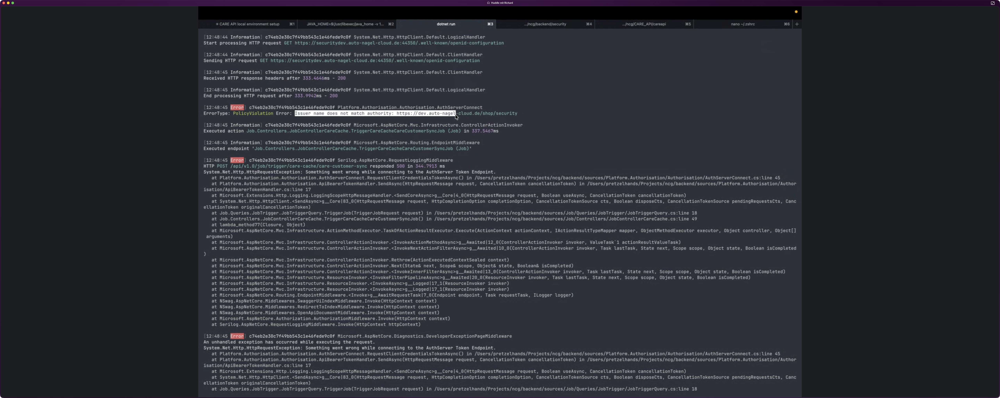

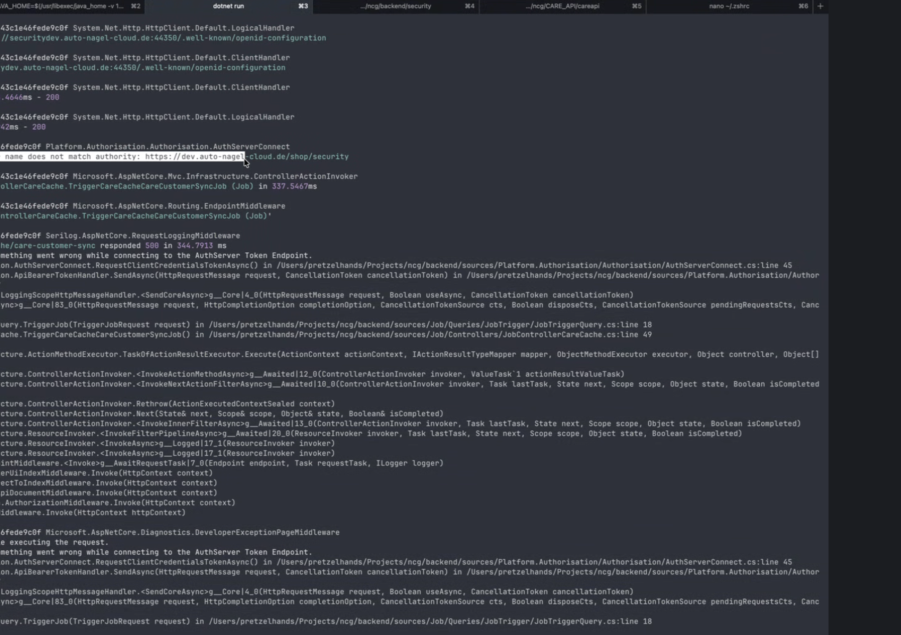

### OCR

**Meeting Notes Extract**

- Appears to be a screen share of a terminal/log window, likely during debugging.
- No webcam/person tiles with identifiable people are visible.
- It is not clear who is talking.
- It is not clear who is presenting, though someone is sharing a terminal session.
- The meeting title says “Huddle mit Richard,” so Richard is strongly deduced as an attendee. This may be a partial attendee result; the screenshot does not show the full participant list.

**Presented Content**

The shared screen shows a terminal with multiple tabs, including:

- `CARE API local environment setup`
- `dotnet run`
- `.../ncg/backend/security`
- `.../ncg/CARE_API/careapi`
- `nano ~/.zshrc`

Visible log/debug content:

- HTTP GET request to:
  - `https://securitydev.auto-nagel-cloud.de:44350/.well-known/openid-configuration`
- Response received:
  - `200`
  - around `333 ms`
- Error in:
  - `Platform.Authorisation.Authorisation.AuthServerConnect`
- Key error:
  - `ErrorType: PolicyViolation`
  - `issuer name does not match authority: https://dev.auto-nagel-cloud.de/shop/security`
- Job endpoint/action involved:
  - `Job.Controllers.JobControllerCareCache.TriggerCareCacheCareCustomerSyncJob`
- Failed request:
  - `HTTP POST /api/v1.0/job/trigger/care-cache/care-customer-sync responded 500 in 344.7913 ms`
- Exception:
  - `System.Net.Http.HttpRequestException: Something went wrong while connecting to the AuthServer Token Endpoint.`
- Stack trace references include:
  - `AuthServerConnect.cs:line 43`
  - `ApiBearerTokenHandler.cs:line 17`
  - `JobTriggerQuery.cs:line 18`
  - `JobControllerCareCache.cs:line 49`
- Developer exception middleware reports:
  - `An unhandled exception has occurred while executing the request.`

## Screenshot [00:20:40]
Window: Richard - nacarmos - Slack

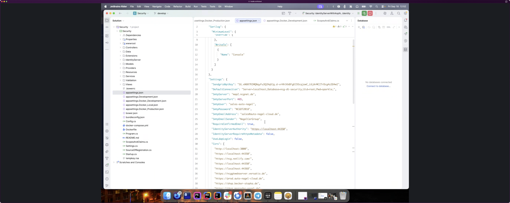

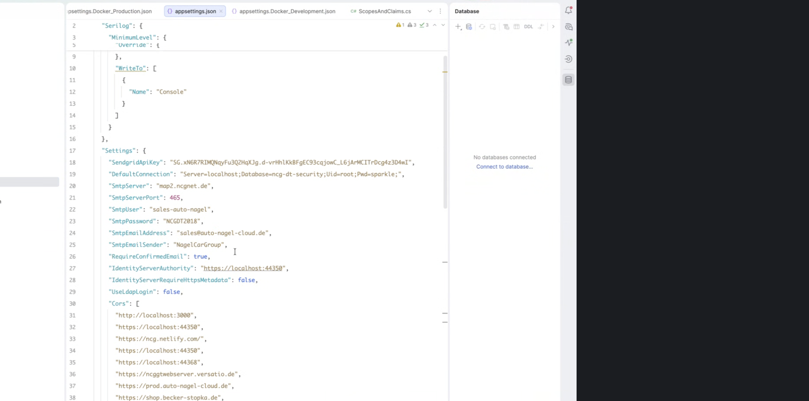

### OCR

- No visible webcam/person tiles in the meeting area; the screenshot appears to show only a shared screen, so the full participant list is not clear.
- Meeting title indicates `Huddle mit Richard`, so `Richard` is strongly deduced as an attendee, but the visible attendee list is partial.
- It is not clear who is talking from the screenshot.
- The presenter appears to be sharing a macOS desktop with JetBrains Rider open.
- Presented content: JetBrains Rider project `Security`, branch `develop`, editing `appsettings.json` for an ASP.NET/IdentityServer-related project.

Visible shared-screen content:

```markdown
# JetBrains Rider - Security Project

Open file: `appsettings.json`

Visible project tree:
- Security
  - Dependencies
  - Properties
  - wwwroot
  - Controllers
  - Data
  - Extensions
  - IdentityServer
  - Models
  - Providers
  - Resources
  - Services
  - Validation
  - Views
  - `.bowerrc`
  - `appsettings.json`
  - `appsettings.Development.json`
  - `appsettings.Docker_Development.json`
  - `appsettings.Docker_Local.json`
  - `appsettings.Docker_Production.json`
  - `bower.json`
  - `bundleconfig.json`
  - `Config.cs`
  - `docker-compose.yml`
  - `Dockerfile`
  - `Program.cs`
  - `README.md`
  - `ScopesAndClaims.cs`
  - `Settings.cs`
  - `SourceOfRegistration.cs`
  - `Startup.cs`
  - `tempkey.rsa`

Visible editor tabs:
- `appsettings.Docker_Production.json`
- `appsettings.json`
- `appsettings.Docker_Development.json`
- `ScopesAndClaims.cs`

Visible JSON/config areas:
- `Serilog`
  - `MinimumLevel`
  - `Override`
  - `WriteTo`
    - `Name`: `Console`
- `Settings`
  - `SendgridApiKey`: visible secret value redacted
  - `DefaultConnection`: visible local database connection string redacted
  - `SmtpServer`: `map2.ncgnet.de`
  - `SmtpServerPort`: `465`
  - `SmtpUser`: `sales-auto-nagel`
  - `SmtpPassword`: visible password redacted
  - `SmtpEmailAddress`: `sales@auto-nagel-cloud.de`
  - `SmtpEmailSender`: `NagelCarGroup`
  - `RequireConfirmedEmail`: `true`
  - `IdentityServerAuthority`: `https://localhost:44350`
  - `IdentityServerRequireHttpsMetadata`: `false`
  - `UseLdapLogin`: `false`
  - `Cors`: includes localhost and production/staging URLs

Right panel:
- Database tool window
- Message: `No databases connected`
- Link/button: `Connect to database...`
```

Security note: the shared screen exposes credentials/API keys/passwords in `appsettings.json`; these should be treated as compromised if this meeting recording or screenshot is shared beyond trusted participants.

## Screenshot [00:21:30]
Window: Richard - nacarmos - Slack

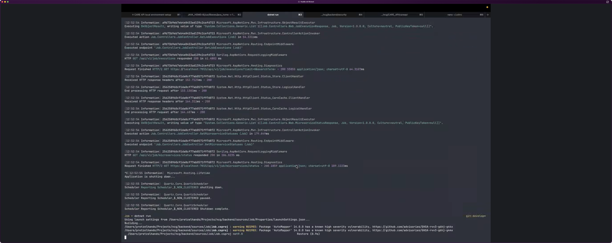

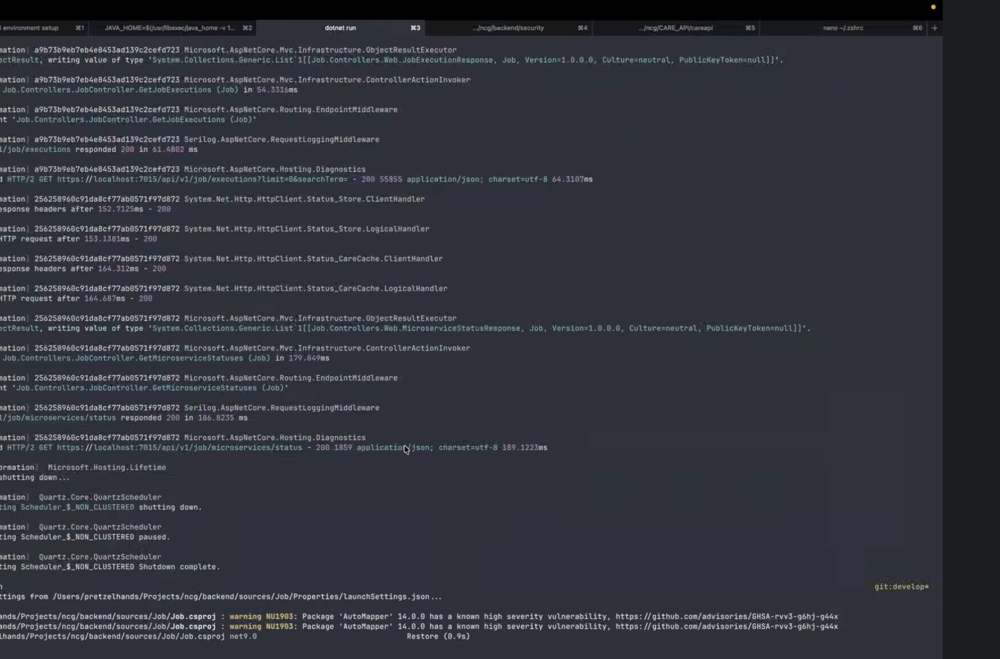

### OCR

- Apparent speaker: Not visible/clear. There are no webcam tiles or active speaker labels.
- Apparent presenter: Not visible/clear. A shared terminal screen is being presented, but the presenter identity is not shown.
- Participants: The screenshot does not show a full participant list. The only clearly visible meeting-related name is “Richard” in the title “Huddle mit Richard,” so any attendee list is partial.
- Presented content: A terminal window showing backend/API development logs and a `dotnet run` command for a local environment.

Visible shared-screen details:

- Terminal tabs include:
  - `CARE API local environment setup`
  - `JAVA_HOME=$(/usr/libexec/java_home -v 1...`
  - `dotnet run`
  - `.../ncg/backend/security`
  - `.../ncg/CARE_API/careapi`
  - `nano ~/.zshrc`
- Logs show ASP.NET Core / Serilog request handling:
  - `HTTP GET /api/v1/job/executions responded 200`
  - `HTTP GET /api/v1/job/microservices/status responded 200`
  - `Executed action Job.Controllers.JobController.GetJobExecutions`
  - `Executed action Job.Controllers.JobController.GetMicroserviceStatuses`
  - `Application is shutting down...`
  - Quartz scheduler messages:
    - `Scheduler Reporting Scheduler_$_NON_CLUSTERED shutting down.`
    - `Scheduler Reporting Scheduler_$_NON_CLUSTERED paused.`
    - `Scheduler Reporting Scheduler_$_NON_CLUSTERED shutdown complete.`
- A command prompt shows:
  - `Job ➜ dotnet run`
  - Uses launch settings from `/Users/pretzelhands/Projects/ncg/backend/sources/Job/Properties/launchSettings.json`
  - Build warnings:
    - `warning NU1903: Package 'AutoMapper' 14.0.0 has a known high severity vulnerability`
    - Advisory URL visible: `https://github.com/advisories/GHSA-rvv3-q6hj-q44x`

## Screenshot [00:22:08]
Window: Richard - nacarmos - Slack

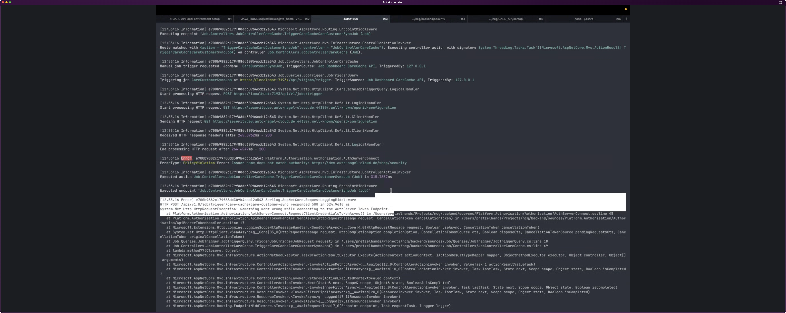

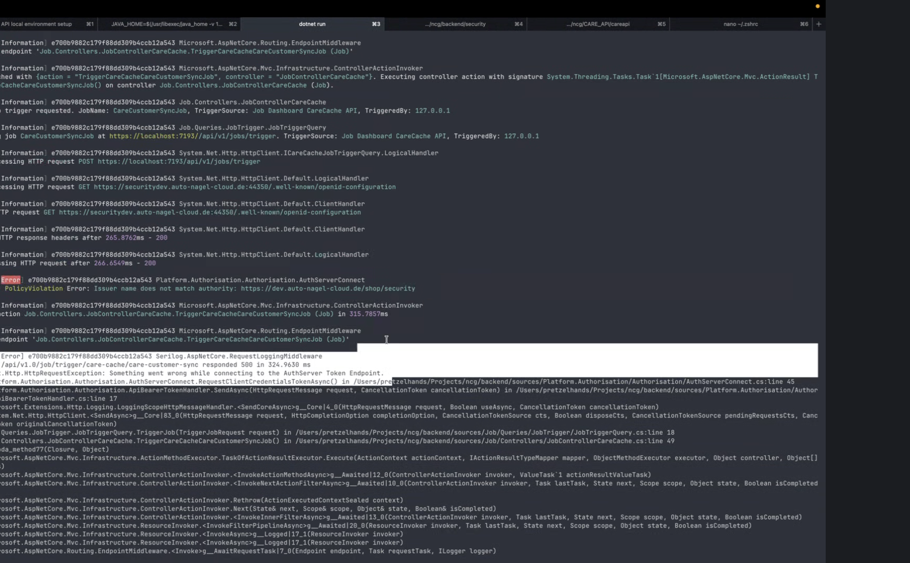

### OCR

**Meeting Notes Extract**
- Appears to be a huddle/meeting titled “Huddle mit Richard”.
- No webcam tiles or participant list are visible, so it is not clear exactly who is in the meeting. “Richard” is strongly deduced from the meeting title, but the attendee list is partial.
- No active speaker indicator is visible; it is unclear who is talking.
- A terminal window appears to be shared/presented. The presenter is not identified in the screenshot.

**Shared Screen Content**
- The shared content is a terminal running a .NET/C# backend service, likely in a tab named `dotnet run`.
- Visible tabs include:
  - `* CARE API local environment setup`
  - `JAVA_HOME=$(usr/libexec/java_home -v 1...`
  - `dotnet run`
  - `../ncg/backend/security`
  - `../ncg/CARE_API/careapi`
  - `nano ~/.zshrc`

**Visible Log Details**
- A job trigger endpoint is being executed:
  - `Job.Controllers.JobControllerCareCache.TriggerCareCacheCareCustomerSyncJob`
- The job appears to be:
  - `CareCustomerSyncJob`
- Trigger source:
  - `Job Dashboard CareCache API`
- Triggered by:
  - `127.0.0.1`
- Request being made:
  - `POST https://localhost:7193/api/v1/jobs/trigger`
- OpenID configuration request:
  - `GET https://securitydev.auto-nagel-cloud.de:44350/.well-known/openid-configuration`
- The OpenID configuration request receives:
  - `200`
- Main error shown:
  - `ErrorType: PolicyViolation`
  - `Issuer name does not match authority: https://dev.auto-nagel-cloud.de/shop/security`
- The API request fails:
  - `HTTP POST /api/v1.0/job/trigger/care-cache/care-customer-synch responded 500 in 324.9630 ms`
- Exception:
  - `System.Net.Http.HttpRequestException: Something went wrong while connecting to the AuthServer Token endpoint.`
- Stack trace references include:
  - `AuthServerConnect.cs:line 45`
  - `ApiBearerTokenHandler.cs:line 17`
  - `JobTriggerQuery.cs:line 18`
  - `JobControllerCareCache.cs:line 49`

## Screenshot [00:23:05]
Window: Richard - nacarmos - Slack

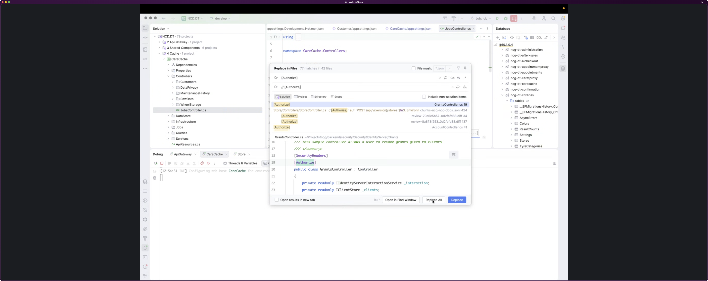

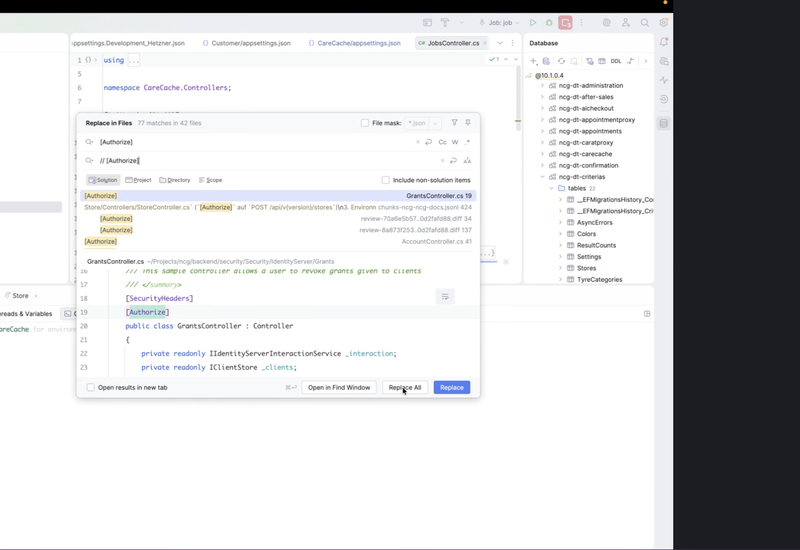

### OCR

No webcam or participant tiles are visible, so it is not clear exactly who is in the meeting. The meeting title says “Huddle mit Richard,” so Richard is strongly deduced as an attendee. There is no clear visual indicator of who is talking or presenting.

The shared screen appears to be a JetBrains IDE/Rider session for a C#/.NET project:

- Solution/project: `NCD.DT`
- Branch: `develop`
- Open file/tab: `JobsController.cs`
- Namespace visible: `CareCache.Controllers`
- Left project tree shows `NCD.DT · 79 projects`, including `ApiGateway`, `Shared Components`, `Cache`, and `CareCache`
- Database pane visible on the right with host `@10.1.0.4` and entries such as `ncg-dt-administration`, `ncg-dt-after-sales`, `ncg-dt-aicheckout`, `ncg-dt-appointments`, `ncg-dt-carecache`, and tables like `AsyncErrors`, `Colors`, `ResultCounts`, `Settings`, `Stores`, `TyreCategories`

A “Replace in Files” dialog is open:

```markdown
Replace in Files

77 matches in 42 files

File mask: `*.json`

Find:
`[Authorize]`

Replace:
`// [Authorize]`

Scope:
Solution

Options/buttons visible:
- Open results in new tab
- Open in Find Window
- Replace All
- Replace
```

Visible search results include:

```markdown
- `[Authorize]` — `GrantsController.cs` line 19
- `Store/Controllers/StoreController.cs` mentioning `[Authorize]` and `POST /api/v{version}/stores`
- `Environment chunks-ncg-ncg-docs.json` line 424
- `review-70a6e5b57...0d2fafd88.diff` line 34
- `review-8a873f253...0d2fafd88.diff` line 137
- `AccountController.cs` line 41
```

Visible code behind the dialog includes:

```csharp
namespace CareCache.Controllers;

[SecurityHeaders]
[Authorize]
public class GrantsController : Controller
{
    private readonly IIdentityServerInteractionService _interaction;
    private readonly IClientStore _clients;
}
```

## Screenshot [00:24:48]
Window: Richard - nacarmos - Slack

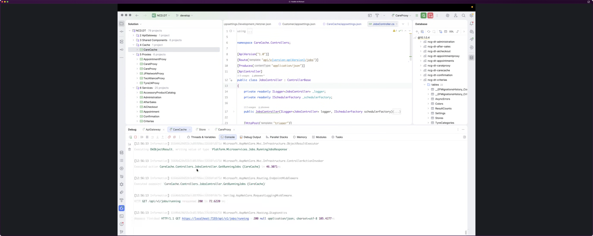

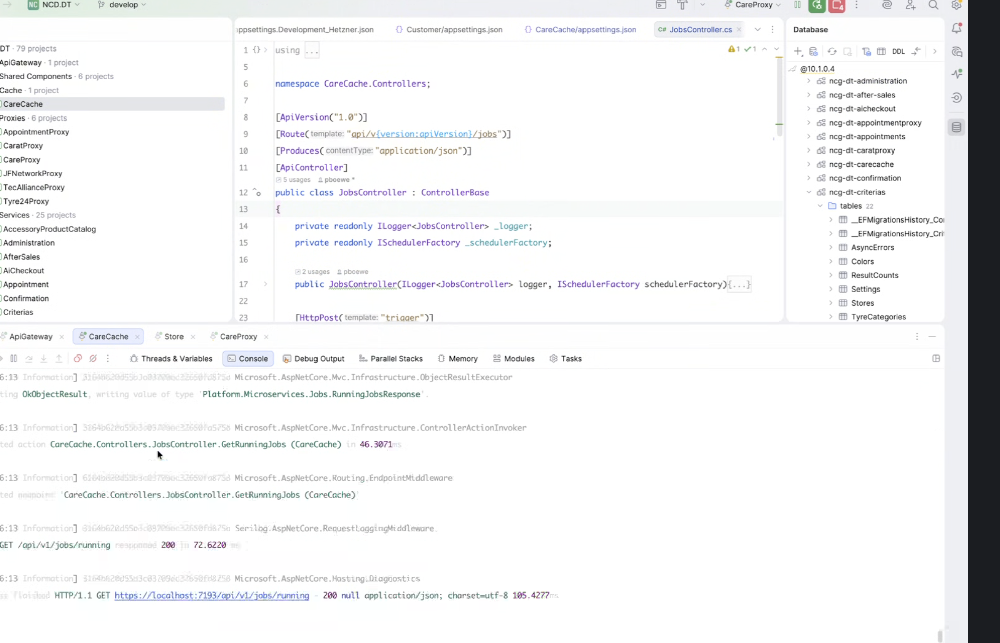

### OCR

No participant tiles or webcams are visible. It is not clear exactly who is in the meeting; the screenshot only shows a shared screen. The meeting title says “Huddle mit Richard,” so Richard is a visible/strongly deduced attendee, but the attendee list is likely partial.

Who appears to be talking: not visible / cannot determine.

Who appears to be presenting: a shared screen is visible, but the presenter’s identity is not shown.

What is being presented: a JetBrains-style IDE showing a .NET/C# solution named `NCD.DT` on branch `develop`, with `JobsController.cs` open in the `CareCache` project. The IDE also shows a database explorer and a debug console.

Visible shared-screen details:
- Solution/project tree:
  - `NCD.DT · 79 projects`
  - Groups include `ApiGateway`, `Shared Components`, `Cache`, `Proxies`, `Services`
  - Selected project: `CareCache`
  - Other visible proxy/service projects include `AppointmentProxy`, `CaratProxy`, `CareProxy`, `JFNetworkProxy`, `TecAllianceProxy`, `Tyre24Proxy`
- Open editor tab:
  - `JobsController.cs`
  - Namespace: `CareCache.Controllers`
  - Attributes visible:
    - `[ApiVersion("1.0")]`
    - `[Route("api/v{version:apiVersion}/jobs")]`
    - `[Produces("application/json")]`
    - `[ApiController]`
  - Class visible:
    - `public class JobsController : ControllerBase`
  - Constructor dependencies visible:
    - `ILogger<JobsController> _logger`
    - `ISchedulerFactory _schedulerFactory`
  - Endpoint visible:
    - `[HttpPost("trigger")]`
- Debug/console output:
  - `Executed action CareCache.Controllers.JobsController.GetRunningJobs (CareCache)`
  - `HTTP GET /api/v1/jobs/running responded 200`
  - `Request finished HTTP/1.1 GET https://localhost:7193/api/v1/jobs/running - 200 ... application/json; charset=utf-8`

## Screenshot [00:25:02]
Window: Richard - nacarmos - Slack

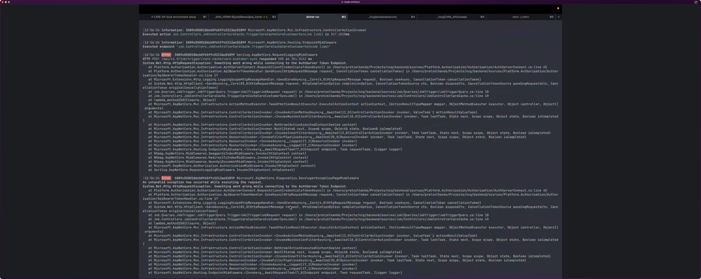

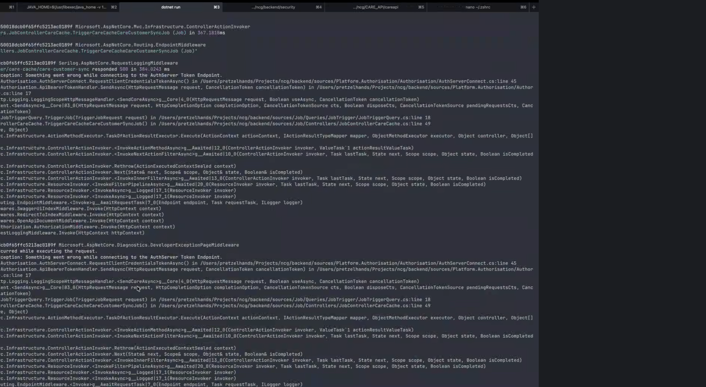

### OCR

- Talking: Not clear from the screenshot; no active speaker indicator or visible webcam/participant tile is shown.
- Presenting: A shared terminal/screen is visible, but the presenter’s identity is not shown. The meeting title says “Huddle mit Richard,” so Richard is likely an attendee, but not necessarily the presenter.
- Participants: No participant tiles are visible. It is not possible to determine exactly who is in the meeting; the visible information is only a partial meeting result.
- Presented content: A terminal window with multiple tabs, focused on `dotnet run`, showing ASP.NET Core logs and an exception during a backend job/API call.

Visible shared-screen notes:

- Terminal tabs include:
  - `CARE API local environment setup`
  - `JAVA_HOME=${usr/libexec/java_home -v 1...`
  - `dotnet run`
  - `~/ncg/backend/security`
  - `~/ncg/CARE_API/careapi`
  - `nano ~/.zshrc`

- The backend logs show:
  - A controller action executed:
    - `Job.Controllers.JobControllerCareCache.TriggerCareCacheCareCustomerSyncJob`
  - Endpoint executed:
    - `Job.Controllers.JobControllerCareCache.TriggerCareCacheCareCustomerSyncJob (Job)`
  - HTTP request failed:
    - `HTTP POST /api/v1.0/job/trigger/care-cache/care-customer-sync responded 500`
  - Main exception:
    - `System.Net.Http.HttpRequestException: Something went wrong while connecting to the AuthServer Token Endpoint.`
  - Relevant stack frames visible:
    - `Platform.Authorisation.Authorisation.AuthServerConnect.RequestClientCredentialsTokenAsync()`
    - `Platform.Authorisation.Authorisation.ApiBearerTokenHandler.SendAsync(...)`
    - `Job.Queries.JobTrigger.JobTriggerQuery.TriggerJob(...)`
    - `Job.Controllers.JobControllerCareCache.TriggerCareCacheCareCustomerSyncJob()`
  - Source file paths visible include:
    - `/Users/pretzelhands/Projects/ncg/backend/sources/Platform.Authorisation/Authorisation/AuthServerConnect.cs:line 45`
    - `/Users/pretzelhands/Projects/ncg/backend/sources/Platform.Authorisation/Authorisation/ApiBearerTokenHandler.cs:line 17`
    - `/Users/pretzelhands/Projects/ncg/backend/sources/Job/Queries/JobTrigger/JobTriggerQuery.cs:line 18`
    - `/Users/pretzelhands/Projects/ncg/backend/sources/Job/Controllers/JobControllerCareCache.cs:line 49`

## Screenshot [00:27:13]
Window: Richard - nacarmos - Slack

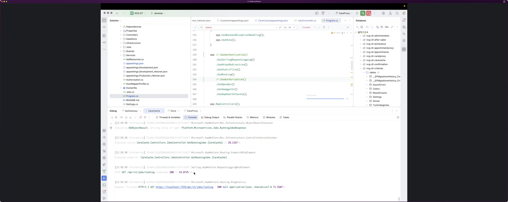

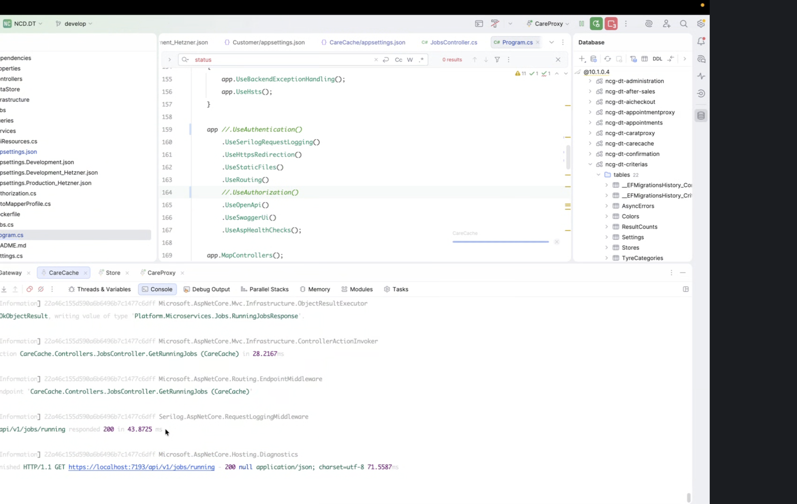

### OCR

**Meeting Notes Extract**

- **Who appears to be talking:** Not visible/clear from the screenshot. No active speaker indicator or participant tile is shown.
- **Who appears to be presenting:** A shared screen is visible, but the presenter’s identity is not shown. The meeting title says “Huddle mit Richard,” so Richard is likely in the meeting, but it is not clear whether Richard is presenting.
- **Participant visibility:** No participant tiles are visible. The screenshot does not show the full attendee list; any attendee metadata is partial.

**Shared Screen Content**

The shared screen shows a JetBrains-style IDE with a .NET/C# solution open.

Visible context:
- Repository/project: `NCD.DT`
- Git branch: `develop`
- Run/debug target appears to be `CareProxy`
- Active editor tab: `Program.cs`
- Other visible tabs include:
  - `Customer/appsettings.json`
  - `CareCache/appsettings.json`
  - `JobsController.cs`
  - `Program.cs`
- The Find box contains `status` and shows `0 results`.
- Left solution tree shows folders/files such as:
  - `Dependencies`
  - `Properties`
  - `Controllers`
  - `DataStore`
  - `Infrastructure`
  - `Jobs`
  - `Queries`
  - `Services`
  - `ApiResources.cs`
  - `appsettings.json`
  - `appsettings.Development.json`
  - `appsettings.Development_Hetzner.json`
  - `appsettings.Production_Hetzner.json`
  - `Authorization.cs`
  - `AutoMapperProfile.cs`
  - `Dockerfile`
  - `Jobs.cs`
  - `Program.cs`
  - `README.md`
  - `Settings.cs`

Visible `Program.cs` code area includes middleware setup around lines 155-169:
- `app.UseBackendExceptionHandling();`
- `app.UseHsts();`
- `app // .UseAuthentication()`
- `.UseSerilogRequestLogging()`
- `.UseHttpsRedirection()`
- `.UseStaticFiles()`
- `.UseRouting()`
- `// .UseAuthorization()`
- `.UseOpenApi()`
- `.UseSwaggerUi()`
- `.UseAspHealthChecks();`
- `app.MapControllers();`

Visible debug console/log output includes:
- `Executing OkObjectResult, writing value of type 'Platform.Microservices.Jobs.RunningJobsResponse'.`
- `Executed action CareCache.Controllers.JobsController.GetRunningJobs (CareCache) in 28.2167ms`
- `Executed endpoint 'CareCache.Controllers.JobsController.GetRunningJobs (CareCache)'`
- `HTTP GET /api/v1/jobs/running responded 200 in 43.8725 ms`
- `Request finished HTTP/1.1 GET https://localhost:7193/api/v1/jobs/running - 200 ... application/json; charset=utf-8 71.5587ms`

## Screenshot [00:27:44]
Window: Richard - nacarmos - Slack

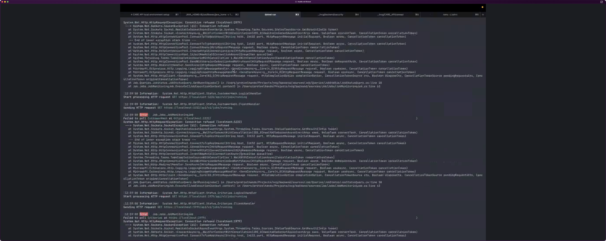

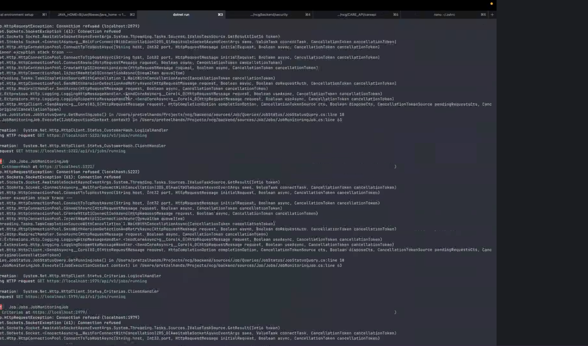

### OCR

No webcam/person tiles are visible. The screenshot appears to show a shared terminal screen in a huddle titled “Huddle mit Richard”; Richard is the only attendee name visible/strongly deducible. It is not clear whether Richard is the full participant list or only the huddle title/partial participant result.

The visible shared content is a terminal running backend services/logs. It appears to be presenting/debugging local API connection failures from a .NET job monitor.

Visible terminal content, cleaned up:

```markdown
Terminal tabs visible:
- CARE API local environment setup
- JAVA_HOME=...
- dotnet run
- .../ncg/backend/security
- .../ncg/CARE_API/careapi
- neng ~/.zshrc

Errors/logs visible:
- `System.Net.Http.HttpRequestException: Connection refused`
- Inner exception: `System.Net.Sockets.SocketException (61): Connection refused`

CustomerHash polling:
- `[12:59:00 Information] System.Net.Http.HttpClient.Status.CustomerHash.LogicalHandler`
- `Start processing HTTP request GET https://localhost:5222/api/v1/jobs/running`
- `[12:59:00 Information] System.Net.Http.HttpClient.Status.CustomerHash.ClientHandler`
- `Sending HTTP request GET https://localhost:5222/api/v1/jobs/running`
- `[12:59:00 Error] Job.Jobs.JobMonitoringJob`
- `Failed to poll CustomerHash at https://localhost:5222/`
- `System.Net.Http.HttpRequestException: Connection refused (localhost:5222)`
- Stack references:
  - `Job.Queries.JobStatus.JobStatusQuery.GetRunningJobs()` in `/Users/pretzelhands/Projects/ncg/backend/sources/Job/Queries/JobStatus/JobStatusQuery.cs:line 18`
  - `Job.Jobs.JobMonitoringJob.Execute(...)` in `/Users/pretzelhands/Projects/ncg/backend/sources/Job/Jobs/JobMonitoringJob.cs:line 63`

Criterias polling:
- `[12:59:00 Information] System.Net.Http.HttpClient.Status.Criterias.LogicalHandler`
- `Start processing HTTP request GET https://localhost:1979/api/v1/jobs/running`
- `[12:59:00 Information] System.Net.Http.HttpClient.Status.Criterias.ClientHandler`
- `Sending HTTP request GET https://localhost:1979/api/v1/jobs/running`
- `[12:59:00 Error] Job.Jobs.JobMonitoringJob`
- `Failed to poll Criterias at https://localhost:1979/`
- `System.Net.Http.HttpRequestException: Connection refused (localhost:1979)`
```

## Screenshot [00:27:49]
Window: Richard - nacarmos - Slack

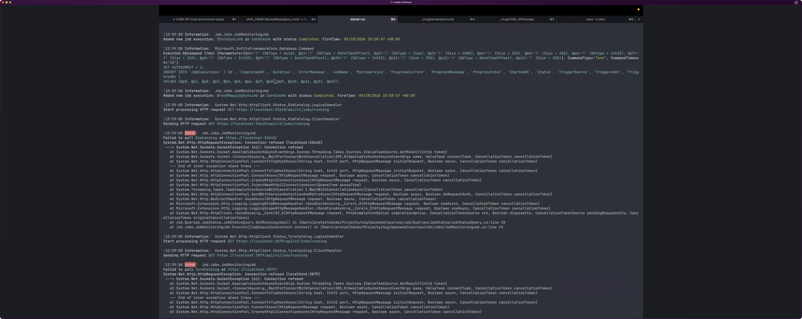

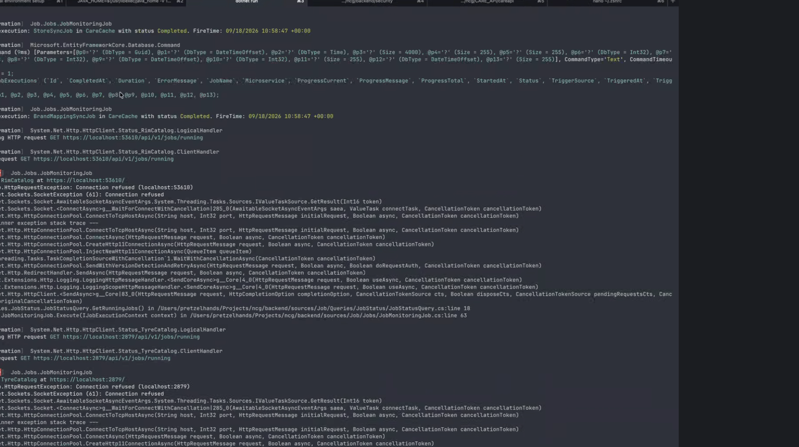

### OCR

No participant tiles or webcams are visible. It is not clear exactly who is in the meeting; the only attendee strongly deducible is Richard from the window title “Huddle mit Richard.” The current speaker is not identifiable. The presenter is also not identifiable, but someone is sharing a terminal window.

Visible shared content is a terminal running a backend service, with the active tab titled `dotnet run`. Other visible tabs include:
- `CARE API local environment setup`
- `JAVA_HOME=$(/usr/libexec/java_home -v 1...`
- `.../ncg/backend/security`
- `.../ncg/CARE_API/careapi`
- `nano ~/.zshrc`

Useful notes from the shared terminal:

```markdown
## Backend runtime logs

- Service appears to be running via `dotnet run`.
- Job monitoring logs show completed jobs:
  - `StoreSyncJob` in `CareCache` with status `Completed`
  - `BrandMappingSyncJob` in `CareCache` with status `Completed`
  - FireTime: `09/18/2026 10:58:47 +00:00`

- Entity Framework logs show an insert into `JobExecutions`:
  - Columns include `Id`, `CompletedAt`, `Duration`, `ErrorMessage`, `JobName`, `Microservice`,
    `ProgressCurrent`, `ProgressMessage`, `ProgressTotal`, `StartedAt`, `Status`,
    `TriggerSource`, `TriggeredAt`, `TriggeredBy`.

- HTTP polling attempts:
  - `GET https://localhost:53610/api/v1/jobs/running`
  - `GET https://localhost:2879/api/v1/jobs/running`

- Errors:
  - Failed to poll `RimCatalog` at `https://localhost:53610/`
  - `System.Net.Http.HttpRequestException: Connection refused (localhost:53610)`
  - Failed to poll `TyreCatalog` at `https://localhost:2879/`
  - `System.Net.Http.HttpRequestException: Connection refused (localhost:2879)`

- Visible stack trace references:
  - `/Users/pretzelhands/Projects/ncg/backend/sources/Job/Queries/JobStatus/JobStatusQuery.cs:line 18`
  - `/Users/pretzelhands/Projects/ncg/backend/sources/Job/Jobs/JobMonitoringJob.cs:line 63`
```

## Screenshot [00:28:19]
Window: Richard - nacarmos - Slack

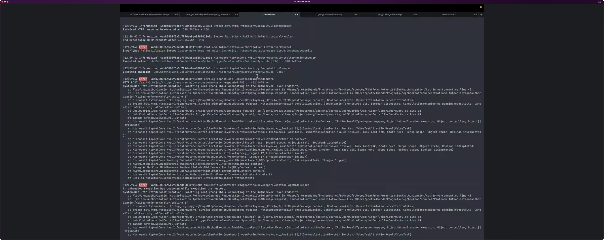

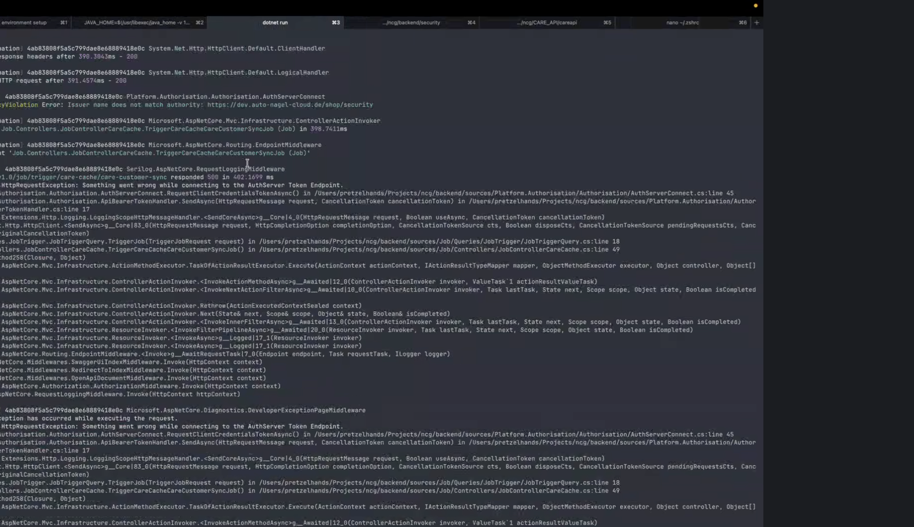

### OCR

No participant tiles or webcams are visible, so the screenshot does not make it clear exactly who is in the meeting. The meeting title says “Huddle mit Richard,” so Richard is a strongly deduced attendee, but the visible attendee list is only partial/absent.

Who appears to be talking: unclear; no visible speaker indicator or person tile.

Who appears to be presenting: unclear; a shared terminal screen is visible, but the presenter’s identity is not shown.

What is being presented: a terminal session running backend/API logs, apparently debugging a .NET service/auth issue.

Visible shared-screen notes:

- Active terminal tab appears to be `dotnet run`.
- Other visible tabs include:
  - `* CARE API local environment setup`
  - `JAVA_HOME=...`
  - `.../ncg/backend/security`
  - `.../ncg/CARE_API/careapi`
  - `nano ~/.zshrc`
- Logs show successful HTTP responses followed by authorization/token errors.
- Key visible error:
  - `ErrorType: PolicyViolation`
  - `Error: Issuer name does not match authority: https://dev.auto-nagel-cloud.de/shop/security`
- A request failed:
  - `HTTP POST /api/v1.0/job/trigger/care-cache/care-customer-sync responded 500 in 402.1699 ms`
- Exception shown:
  - `System.Net.Http.HttpRequestException: Something went wrong while connecting to the AuthServer Token Endpoint.`
- Stack trace references:
  - `Platform.Authorisation.Authorisation.AuthServerConnect.RequestClientCredentialsTokenAsync()` in `AuthServerConnect.cs:line 45`
  - `Platform.Authorisation.Authorisation.ApiBearerTokenHandler.SendAsync(...)` in `ApiBearerTokenHandler.cs:line 17`
  - `Job.Queries.JobTrigger.JobTriggerQuery.TriggerJob(...)` in `JobTriggerQuery.cs:line 18`
  - `Job.Controllers.JobControllerCareCache.TriggerCareCacheCareCustomerSyncJob()` in `JobControllerCareCache.cs:line 49`

## Screenshot [00:30:23]
Window: Richard - nacarmos - Slack

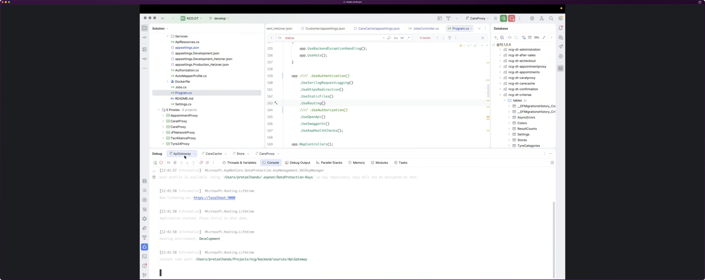

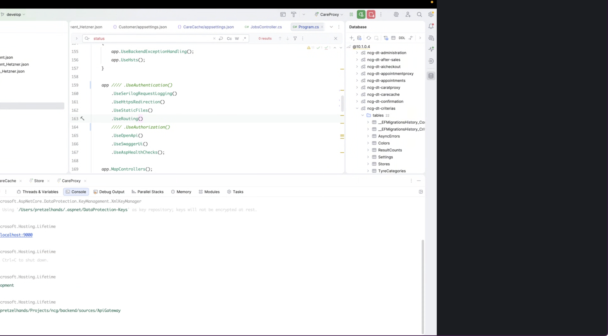

### OCR

No visible webcam tiles or participant list are shown. It is not clear exactly who is in the meeting; the visible information is only the meeting title, “Huddle mit Richard,” so Richard is a strongly deduced attendee but the attendee list is partial.

Who appears to be talking: not clear from the screenshot; no active speaker indicator or visible participant tile is identifiable.

Who appears to be presenting: not explicitly identified. A shared screen is visible, showing a JetBrains-style IDE with backend code and debug output.

What is being presented:
- A software development environment for repository/project `NCD.DT` on branch `develop`.
- The active context appears to be `CareProxy`, with `Program.cs` open.
- A search panel shows search term `status` with `0 results`.
- The code area shows ASP.NET Core middleware setup around lines 155-169.
- Debug console is open for `ApiGateway`, showing the app listening on `https://localhost:9000`.

Visible code/text captured:

### IDE / Project Context
- Repository/project: `NCD.DT`
- Branch: `develop`
- Run/debug target or context: `CareProxy`
- Open tabs include:
  - `appsettings.Development_Hetzner.json`
  - `Customer/appsettings.json`
  - `CareCache/appsettings.json`
  - `JobsController.cs`
  - `Program.cs`

### Search
- Search term: `status`
- Result count: `0 results`

### Visible `Program.cs` middleware section
- `app.UseBackendExceptionHandling();`
- `app.UseHsts();`
- commented out: `app //// .UseAuthentication()`
- `.UseSerilogRequestLogging()`
- `.UseHttpsRedirection()`
- `.UseStaticFiles()`
- `.UseRouting()`
- commented out: `//// .UseAuthorization()`
- `.UseOpenApi()`
- `.UseSwaggerUi()`
- `.UseAspHealthChecks();`
- `app.MapControllers();`

### Solution / File Tree Snippets
- `Services`
- `ApiResources.cs`
- `appsettings.json`
- `appsettings.Development.json`
- `appsettings.Development_Hetzner.json`
- `appsettings.Production_Hetzner.json`
- `Authorization.cs`
- `AutomapperProfile.cs`
- `Dockerfile`
- `Jobs.cs`
- `Program.cs`
- `README.md`
- `Settings.cs`
- `5 Proxies - 6 projects`
- `AppointmentProxy`
- `CaratProxy`
- `CareProxy`
- `JFNetworkProxy`
- `TecAllianceProxy`
- `Tyre24Proxy`

### Database Panel Snippets
- `@10.1.0.4`
- `ncg-dt-administration`
- `ncg-dt-after-sales`
- `ncg-dt-aicheckout`
- `ncg-dt-appointmentproxy`
- `ncg-dt-appointments`
- `ncg-dt-caratproxy`
- `ncg-dt-carecache`
- `ncg-dt-confirmation`
- `ncg-dt-criterias`
- `tables 22`
- `__EFMigrationsHistory...`
- `AsyncErrors`
- `Colors`
- `ResultCounts`
- `Settings`
- `Stores`
- `TyreCategories`

### Debug Console
- Debug target tabs include: `ApiGateway`, `CareCache`, `Store`, `CareProxy`
- Console shows:
  - `[12:41:57 Information] Microsoft.AspNetCore.DataProtection.KeyManagement.XmlKeyManager`
  - `User profile is available. Using '/Users/pretzelhands/.aspnet/DataProtection-Keys' as key repository; keys will not be encrypted at rest.`
  - `[12:41:58 Information] Microsoft.Hosting.Lifetime`
  - `Now listening on: https://localhost:9000`
  - `Application started. Press Ctrl+C to shut down.`
  - `Hosting environment: Development`
  - `Content root path: /Users/pretzelhands/Projects/ncg/backend/sources/ApiGateway`

## Screenshot [00:31:50]
Window: Richard - nacarmos - Slack

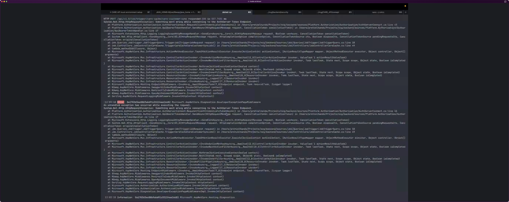

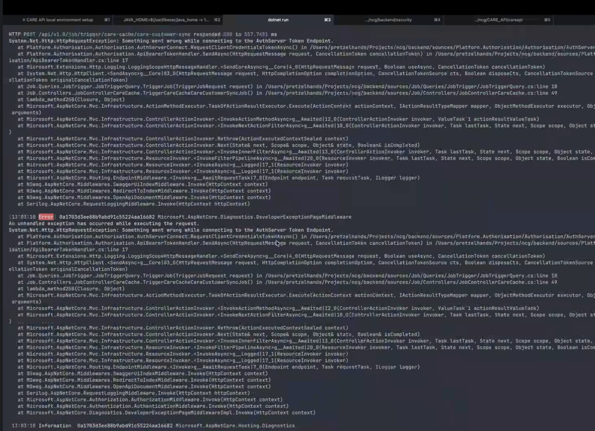

### OCR

No participant tiles or webcams are visible, so it is not clear who is talking. The visible meeting title says “Huddle mit Richard,” so Richard is a strongly deduced attendee, but the attendee list is only partial.

The shared/presented content appears to be a terminal session running a .NET backend service. The visible tab title is `dotnet run`, and the terminal shows an ASP.NET Core stack trace for a failed API request.

Useful visible meeting notes:

```markdown
## Presented Screen

A terminal/tmux session is open with several tabs:

- `* CARE API local environment setup`
- `JAVA_HOME=$(/usr/libexec/java_home -v 1...`
- `dotnet run`
- `.../ncg/backend/security`
- `.../ncg/CARE_API/careapi`
- `nano ~/.zshrc`

## Visible Error

`HTTP POST /api/v1.0/job/trigger/care-cache/care-customer-sync` responded `500` in `557.7451 ms`.

Exception:

`System.Net.Http.HttpRequestException: Something went wrong while connecting to the AuthServer Token Endpoint.`

Relevant stack trace lines visible:

- `Platform.Authorisation.Authorisation.AuthServerConnect.RequestClientCredentialsTokenAsync()`  
  `/Users/pretzelhands/Projects/ncg/backend/sources/Platform.Authorisation/Authorisation/AuthServerConnect.cs:line 45`
- `Platform.Authorisation.Authorisation.ApiBearerTokenHandler.SendAsync(...)`  
  `/Users/pretzelhands/Projects/ncg/backend/sources/Platform.Authorisation/Authorisation/ApiBearerTokenHandler.cs:line 17`
- `Job.Queries.JobTrigger.JobTriggerQuery.TriggerJob(...)`  
  `/Users/pretzelhands/Projects/ncg/backend/sources/Job/Queries/JobTrigger/JobTriggerQuery.cs:line 18`
- `Job.Controllers.JobControllerCareCache.TriggerCareCacheCareCustomerSyncJob()`  
  `/Users/pretzelhands/Projects/ncg/backend/sources/Job/Controllers/JobControllerCareCache.cs:line 49`

Log line visible:

`13:03:10 Error ... Microsoft.AspNetCore.Diagnostics.DeveloperExceptionPageMiddleware`

Message:

`An unhandled exception has occurred while executing the request.`
```

## Screenshot [00:32:32]
Window: Richard - nacarmos - Slack

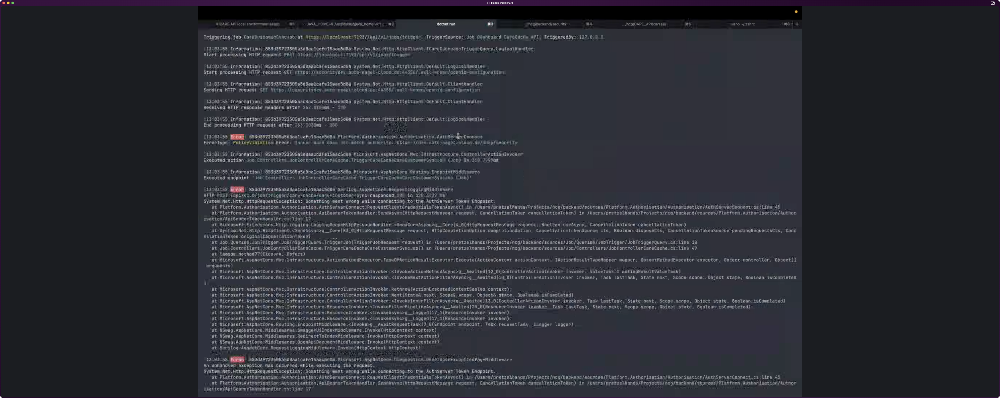

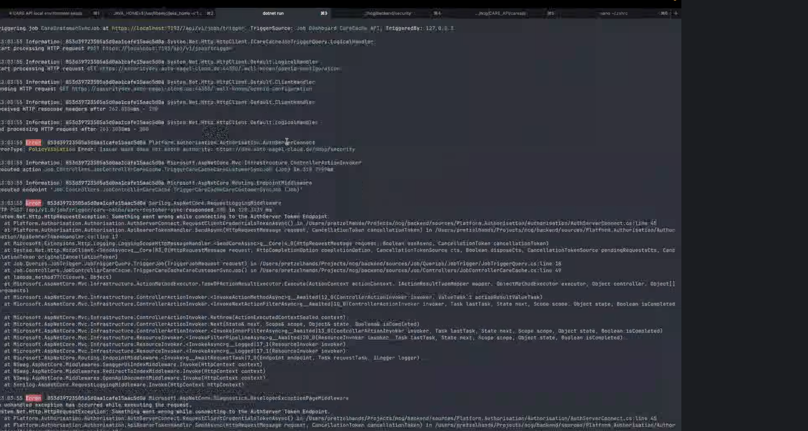

### OCR

**Meeting Notes**

- No webcam tiles or participant list are visible. It is not clear exactly who is in the meeting; the only attendee strongly deduced is Richard from the window title “Huddle mit Richard.”
- It is not clear who is talking. No active-speaker indicator or visible person tile is shown.
- A shared screen appears to be presented, but the presenter is not identifiable from the screenshot.
- The shared content is a terminal / development environment showing `dotnet run` output and ASP.NET Core logs.
- Visible issue: repeated `Error` entries and stack traces related to authorization/token handling while processing a job trigger request.

**Visible Shared Screen Content**

The terminal appears to show several tabs/panes, including labels resembling:

- `CARE API local environment tests`
- `JAVA_HOME=...`
- `dotnet run`
- paths involving `/ncg/PlatformSecurity...`
- `/ncg/CARE_API...`
- `~/.zshrc`

Key visible log content includes:

- HTTP requests being processed, including:
  - `POST https://localhost:.../api/v1/jobtrigger`
  - `GET https://...auth.../.well-known/openid-configuration`
- ASP.NET Core / Microsoft logs:
  - `System.Net.Http.HttpClient...`
  - `Microsoft.AspNetCore.Mvc.Infrastructure.ControllerActionInvoker`
  - `Microsoft.AspNetCore.Routing.EndpointMiddleware`
- Error text visible:
  - `Platform.Authorisation.Authorisation.AuthServerConnect`
  - `ErrorType: PolicyValidation`
  - `System.Net.Http.HttpRequestException: Something went wrong while connecting to the AuthServer Token Endpoint`
  - `An unhandled exception has occurred while executing the request`
- Stack trace references visible files/lines:
  - `.../Platform.Authorisation/Authorisation/AuthServerConnect.cs:line 45`
  - `.../Platform.Authorisation/ApiBearerTokenHandler.cs:line 17`
  - `.../Job/Queries/JobTrigger/JobTriggerQuery.cs:line 18`
  - `.../Job/Controllers/JobControllerCareCache.cs:line 49`

## Screenshot [00:39:56]
Window: Richard - nacarmos - Slack

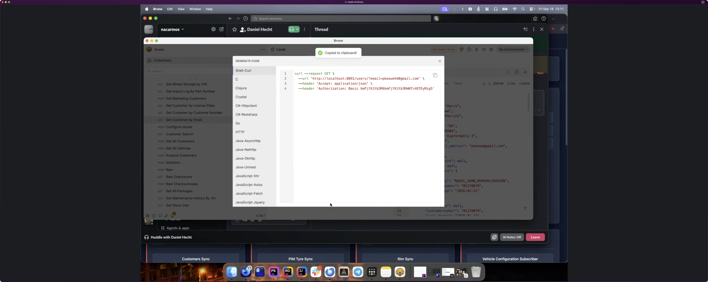

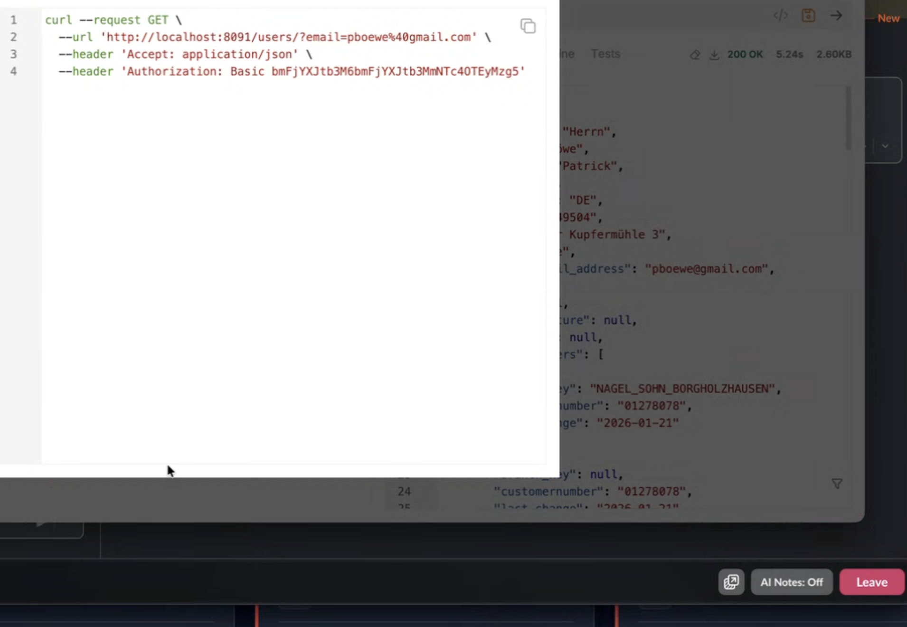

### OCR

The screenshot shows a shared desktop during a huddle/meeting. No webcam tiles are visible, so the visible participant information is partial.

- Appears to be talking: Daniel Hecht may be active/online based on the green status dot next to the name, but the screenshot does not clearly show a speaking indicator.
- Appears to be presenting: The shared screen appears to be showing the Bruno API client.
- Visible meeting/attendee names: Daniel Hecht is visible in the huddle UI; Richard is visible in the macOS title bar as “Huddle mit Richard.” These may be partial attendees only.
- Presented content: A Bruno API client window with a “GENERATE CODE” modal open, showing generated Shell/curl code for a GET request.

Visible shared-screen text captured:

```markdown
# Bruno

Workspace/user: `bruno`

## Generate Code

Selected language: `Shell-Curl`

Other visible language options:
- C
- Clojure
- Crystal
- C#-Httpclient
- C#-Restsharp
- Go
- HTTP
- Java-Asynchttp
- Java-Nethttp
- Java-Okhttp
- Java-Unirest
- JavaScript-Xhr
- JavaScript-Axios
- JavaScript-Fetch
- JavaScript-Jquery

Toast notification:
- Copied to clipboard!

## Visible curl snippet

```sh
curl --request GET \
  --url 'http://localhost:8091/users/?email=pboewe%40gmail.com' \
  --header 'Accept: application/json' \
  --header 'Authorization: Basic ...'
```

## Background API collection/request list

Visible entries include:
- Get Wheel Storage by VIN
- Get Import Log By Part Number
- Get Marketing Customers
- Get Customer by License Plate
- Get Customer by Customer Number
- Get Customer by Email
- Configure stores
- Customer Search
- Get All Customers
- Get All Vehicles
- Analyze Customers
- Statistics
- Raw
- Raw Checksums
- Raw Checksumsaaa
- Get All Packages
- Get Maintenance History By Vin
- Get Store User

Visible status/result area:
- `200 OK`
- `5.24s`
- `2.60KB`
```

## Screenshot [00:43:57]
Window: Richard - nacarmos - Slack

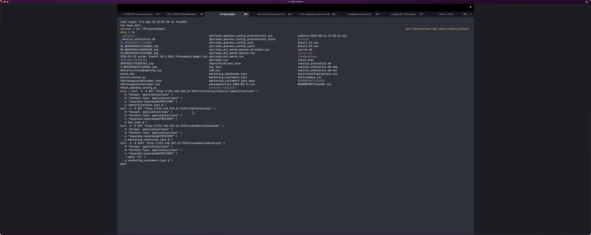

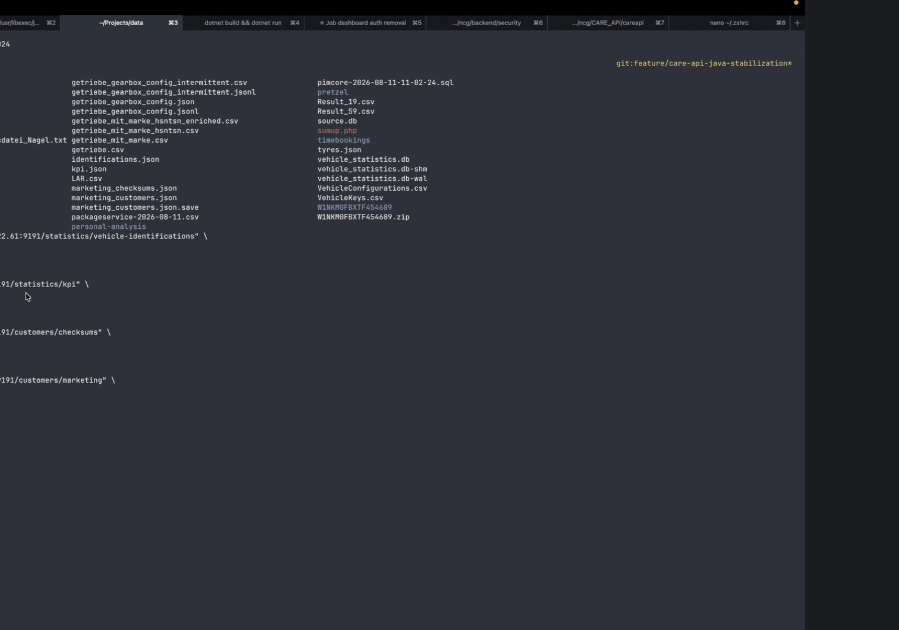

### OCR

No webcam tiles or participant tiles are visible. The screenshot shows a shared terminal session, but it is not clear who is speaking or who is presenting. The meeting title says “Huddle mit Richard,” so Richard is strongly deducible as an attendee, but the visible attendee list is only partial / not shown.

Shared content appears to be a terminal in `~/Projects/data`, likely used to inspect data files and run API export/download commands against a local/internal service at `192.168.222.61:9191`.

Visible terminal content, cleaned up:

```markdown
# Terminal / Shared Screen

Tabs visible include:
- `* CARE API local environmen...`
- `JAVA_HOME=$(usr/libexec/...`
- `~/Projects/data`
- `dotnet build && dotnet run`
- `* Job dashboard auth removal`
- `.../ncq/backend/security`
- `.../ncq/CARE_API/careapi`
- `nano ~/.zshrc`

Shell context:
- Last login: Fri Sep 18 13:07:38 on ttys024
- `careapi > cd ~/Projects/data`
- Git branch shown: `feature/care-api-java-stabilization*`

Directory listing in `~/Projects/data` includes:
- `__pycache__`
- `_vehicle_statistics.db`
- `01_WDD2052041F265886`
- `01_WDD2052041F265886.zip`
- `03_WDD2050141R505658.zip`
- `10_WDD2052041F265886.jpg`
- `2026-05-18 autom. Export 18.5.2026 Preisdatei_Nagel.txt`
- `3KPFX81C7TE305701`
- `3KPFX81C7TE305701.zip`
- `4_WDD2052041F265886.jpg`
- `Aktuelle_Preisänderung.zip`
- `count.php`
- `enrich_hsntsn.py`
- `fahrzeugausstattungen.json`
- `fahrzeugausstattungen.zip`
- `fetch_gearbox_config.py`
- `getriebe_gearbox_config_intermittent.csv`
- `getriebe_gearbox_config_intermittent.jsonl`
- `getriebe_gearbox_config.json`
- `getriebe_gearbox_config.jsonl`
- `getriebe_mit_marke_hsntsn_enriched.csv`
- `getriebe_mit_marke_hsntsn.csv`
- `getriebe_mit_marke.csv`
- `getriebe.csv`
- `identifications.json`
- `kpi.json`
- `LAR.csv`
- `marketing_checksums.json`
- `marketing_customers.json`
- `marketing_customers.json.save`
- `packageservice-2026-08-11.csv`
- `personal-analysis`
- `pimcore-2026-08-11-02-24.sql`
- `pretzel`
- `Result_19.csv`
- `Result_59.csv`
- `source.db`
- `sumup.php`
- `timebookings`
- `tyres.json`
- `vehicle_statistics.db`
- `vehicle_statistics.db-shm`
- `vehicle_statistics.db-wal`
- `VehicleConfigurations.csv`
- `VehicleKeys.csv`
- `W1NKM0FBXTF454689`
- `W1NKM0FBXTF454689.zip`

Commands being prepared/run:
- `curl -s -X GET "http://192.168.222.61:9191/statistics/vehicle-identifications" ... -o identifications.json &`
- `curl -s -X GET "http://192.168.222.61:9191/statistics/kpi" ... -o kpi.json &`
- `curl -s -X GET "http://192.168.222.61:9191/customers/checksums" ... -o marketing_checksums.json &`
- `curl -s -X POST "http://192.168.222.61:9191/customers/marketing" ... --data '{}' -o marketing_customers.json &`
- `wait`

Note: the commands include an HTTP basic-auth credential visible on screen; it is not repeated here.
```

## Screenshot [00:44:15]
Window: Richard - nacarmos - Slack

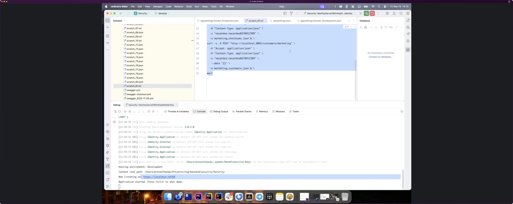

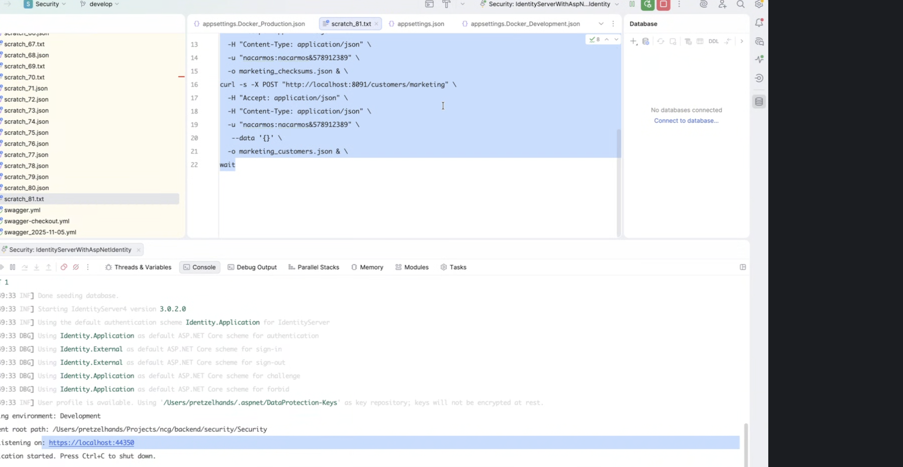

### OCR

The screenshot shows a shared JetBrains Rider window during a huddle. No webcam tiles or participant list are visible, so the visible attendee information is only partial.

- Appears to be presenting: not explicitly labeled; the shared screen is likely from the person in the “Huddle mit Richard” session, but the screenshot does not confirm the presenter.
- Appears to be talking: not clear; no visible active-speaker indicator or participant tile.
- Visible/deduced attendee: Richard, from the meeting title “Huddle mit Richard”.
- Presented content: JetBrains Rider project named `Security`, branch `develop`, editing `scratch_81.txt` with curl commands and showing a running debug console for an IdentityServer/ASP.NET Core app.

Visible shared-screen notes:

```markdown
## JetBrains Rider / Security Project

Open project/window:
- `Security`
- Branch: `develop`
- Run configuration/title: `Security: IdentityServerWithAspN...Identity`

Open/editor tabs:
- `appsettings.Docker_Production.json`
- `scratch_81.txt`
- `appsettings.json`
- `appsettings.Docker_Development.json`

Selected code in `scratch_81.txt` includes curl POST requests:

```bash
-H "Content-Type: application/json" \
-u "nacarmos:nacarmos&578912389" \
-o marketing_checksums.json & \

curl -s -X POST "http://localhost:8091/customers/marketing" \
  -H "Accept: application/json" \
  -H "Content-Type: application/json" \
  -u "nacarmos:nacarmos&578912389" \
  --data '{}' \
  -o marketing_customers.json & \

wait
```

Solution/sidebar visible files include:
- `scratch_67.txt`
- `scratch_68.json`
- `scratch_69.txt`
- `scratch_70.txt`
- `scratch_71.json`
- `scratch_72.json`
- `scratch_73.json`
- `scratch_74.json`
- `scratch_75.json`
- `scratch_76.json`
- `scratch_77.json`
- `scratch_78.json`
- `scratch_79.json`
- `scratch_80.json`
- `scratch_81.txt`
- `swagger.yml`
- `swagger-checkout.yml`
- `swagger_2025-11-05.yml`

Database panel:
- “No databases connected”
- “Connect to database...”

Debug console visible lines:
- `[12:49:33 INF] Done seeding database.`
- `[12:49:33 INF] Starting IdentityServer4 version 3.0.2.0`
- `Hosting environment: Development`
- `Content root path: /Users/pretzelhands/Projects/ncg/backend/security/Security`
- `Now listening on: https://localhost:44350`
- `Application started. Press Ctrl+C to shut down.`
```

## Screenshot [00:47:06]
Window: Richard - nacarmos - Slack

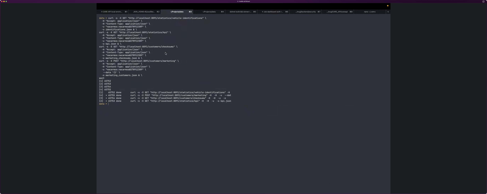

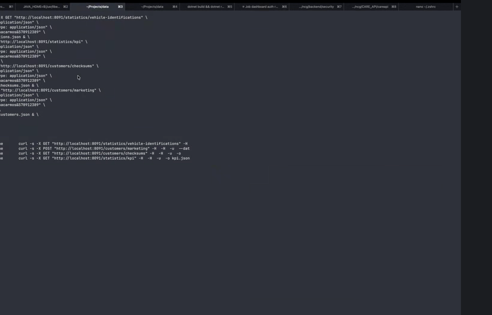

### OCR

No webcam tiles or participant list are visible, so it is not clear exactly who is in the meeting. The window title says “Huddle mit Richard,” so Richard is strongly deducible as an attendee, but the visible attendee list is only partial.

Who appears to be talking: not clear from the screenshot; no active speaker indicator or visible webcam tile.

Who appears to be presenting: not visually identifiable. A shared terminal screen is visible, but the presenter name is not shown.

What is being presented: a terminal session in `~/Projects/data`, showing `curl` commands against local CARE API endpoints on `localhost:8091`, writing JSON responses to files and running the requests in the background.

Visible shared-screen text, cleaned up:

```bash
data > curl -s -X GET "http://localhost:8091/statistics/vehicle-identifications" \
  -H "Accept: application/json" \
  -H "Content-Type: application/json" \
  -u "nacarmos:[redacted]" \
  -o identifications.json & \

curl -s -X GET "http://localhost:8091/statistics/kpi" \
  -H "Accept: application/json" \
  -H "Content-Type: application/json" \
  -u "nacarmos:[redacted]" \
  -o kpi.json & \

curl -s -X GET "http://localhost:8091/customers/checksums" \
  -H "Accept: application/json" \
  -H "Content-Type: application/json" \
  -u "nacarmos:[redacted]" \
  -o marketing_checksums.json & \

curl -s -X POST "http://localhost:8091/customers/marketing" \
  -H "Accept: application/json" \
  -H "Content-Type: application/json" \
  -u "nacarmos:[redacted]" \
  --data '{}' \
  -o marketing_customers.json & \

wait
[1] 65752
[2] 65753
[3] 65754
[4] 65755
[1] + 65752 done ...
[4] + 65755 done ...
[3] + 65754 done ...
[2] + 65753 done ...
data >
```

Relevant terminal tabs visible include:
- `CARE API local enviro...`
- `JAVA_HOME=${/usr/libe...`
- `~/Projects/data`
- `dotnet build && dotnet r...`
- `Job dashboard auth r...`
- `.../ncg/backend/security`
- `.../ncg/CARE_API/careapi`
- `nano ~/.zshrc`

## Screenshot [00:49:46]
Window: Richard - nacarmos - Slack

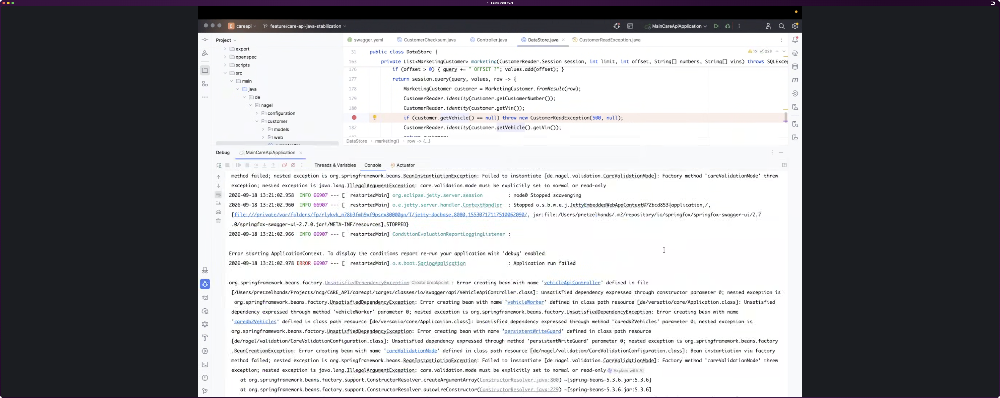

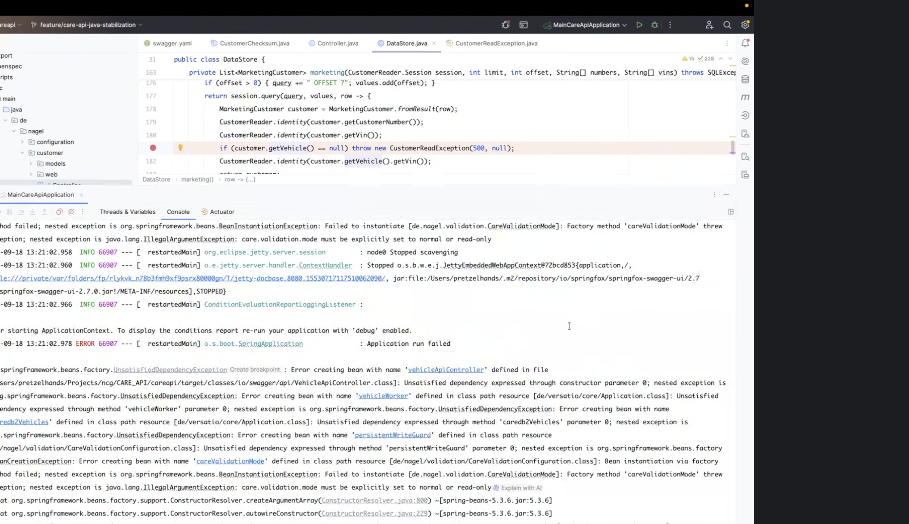

### OCR

Who appears to be talking:
- Not visible/clear. No active speaker indicator or webcam tile is shown.

Who appears to be presenting:
- A shared screen is visible, but the presenter identity is not explicitly shown.
- The meeting title says “Huddle mit Richard,” so Richard is a visible/deducible attendee, but it is not certain from the screenshot that Richard is the presenter.

Participants:
- No participant tiles or attendee list are visible.
- The visible participant information is partial only; the screenshot does not make it clear exactly who is in the meeting.
- Clearly/deducibly visible attendee: Richard.

Shared screen content:
- The presenter is sharing an IntelliJ IDEA window for a Java/Spring project named `careapi`.
- Git branch visible: `feature/care-api-java-stabilization`.
- Active run configuration: `MainCareApiApplication`.
- Open tabs include:
  - `swagger.yaml`
  - `CustomerChecksum.java`
  - `Controller.java`
  - `DataStore.java`
  - `CustomerReadException.java`
- Active file: `DataStore.java`.
- Visible code is in `public class DataStore`, inside a `marketing(...)` method returning `List<MarketingCustomer>`.
- A highlighted/breakpoint line checks for a missing vehicle and throws:
  - `if (customer.getVehicle() == null) throw new CustomerReadException(500, null);`
- Debug console shows the application failing to start due to Spring bean creation / dependency errors.
- Key visible error:
  - `java.lang.IllegalArgumentException: care.validation.mode must be explicitly set to normal or read-only`
- Additional visible context:
  - `Error starting ApplicationContext`
  - `Application run failed`
  - Bean/dependency chain includes `vehicleApiController`, `vehicleWorker`, `caredb2Vehicles`, `persistentWriteGuard`, and `careValidationMode`.

Cleaned visible text for notes:

- Project: `careapi`
- Branch: `feature/care-api-java-stabilization`
- File: `DataStore.java`
- Method: `marketing(...)`
- Notable code:
  - `MarketingCustomer customer = MarketingCustomer.fromResult(row);`
  - `CustomerReader.identity(customer.getCustomerNumber());`
  - `CustomerReader.identity(customer.getVin());`
  - `if (customer.getVehicle() == null) throw new CustomerReadException(500, null);`
  - `CustomerReader.identity(customer.getVehicle().getVin());`
- Console/error:
  - `Factory method 'careValidationMode' threw exception`
  - `care.validation.mode must be explicitly set to normal or read-only`
  - `Error starting ApplicationContext`
  - `Application run failed`

## Screenshot [00:50:24]
Window: Richard - nacarmos - Slack

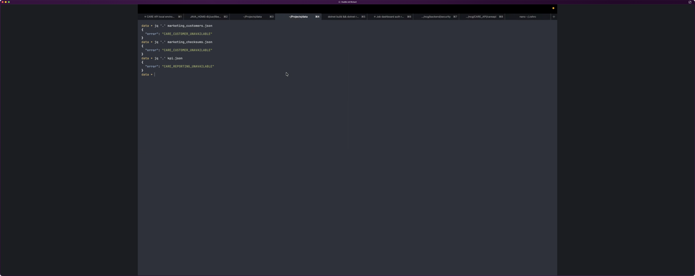

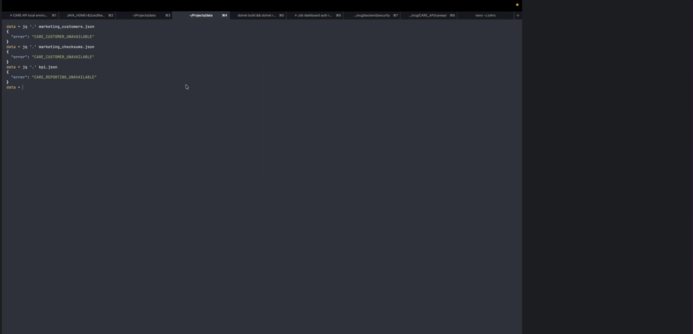

### OCR

No people or participant tiles are visible, so it is not clear exactly who is in the meeting. The visible attendee information is only partial: the window title says “Huddle mit Richard,” so Richard is strongly deduced as an attendee.

Who appears to be talking: not visible / cannot determine.

Who appears to be presenting: not visible / cannot determine by name. A shared screen appears to show a terminal session.

What is being presented: a terminal in `~/Projects/data`, inspecting JSON files with `jq`. The visible outputs show unavailable-service error values.

Visible terminal text:

```markdown
data > jq '.' marketing_customers.json

{
  "error": "CARE_CUSTOMER_UNAVAILABLE"
}

data > jq '.' marketing_checksums.json

{
  "error": "CARE_CUSTOMER_UNAVAILABLE"
}

data > jq '.' kpi.json

{
  "error": "CARE_REPORTING_UNAVAILABLE"
}

data >
```

Visible terminal tabs include partial labels such as:

```markdown
- * CARE API local enviro... #1
- JAVA_HOME=${(/usr/libe... #2
- ~/Projects/data #3
- ~/Projects/data #4
- dotnet build && dotnet r... #5
- * Job dashboard auth r... #6
- ../ncq/backend/security #7
- ../ncq/CARE_API/careapi #8
- nano ~/.zshrc
```

## Summarization Notes
- Transcript labels the main non-Richard speaker as Guest-3; attendee metadata and screenshot show Daniel Hecht in the huddle, but I did not override the speaker label because the evidence is not fully explicit.
- Meeting note contains both `Richard Blechinger` and `Richard`; I left attendees unchanged because the duplicate cannot be safely resolved from the available evidence.

## Summary Agent External File Changes

### /Users/dh/Documents/DanielsVault/Meetings/Dictionary.md

```diff
+ - CareCache
```

### /Users/dh/Documents/DanielsVault/Meetings/Dictionary.md

```diff
+ - CareProxy
```

### /Users/dh/Documents/DanielsVault/Meetings/Dictionary.md

```diff
+ - Bruno
```

### /Users/dh/Documents/DanielsVault/Meetings/Dictionary.md

```diff
+ - IdentityServer
```

